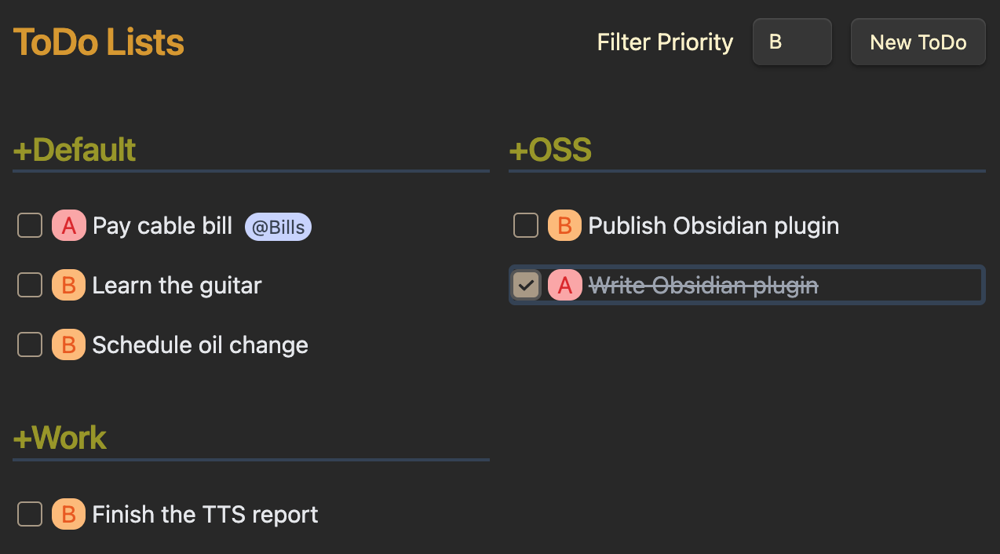

# Obsidian TodoTxt Plugin

Manage [\*.todotxt](https://github.com/todotxt/todo.txt) files in Obsidian.

Install the plugin and put your todo file in your Obsidian vault with the
`.todotxt` extension (ie, `TODO.todotxt`).

## Additional Features

The TodoTxt Plugin supports some extensions to the basic todotxt spec:

### Due Dates

Due dates can be specified by including `due:yyyy-mm-dd` in the text of the
TODO item. The plugin will highlight the due date and shift to orange as the
date nears then red when the due date is missed. The date must be specified in
the `yyyy-mm-dd` format (including padding the month or day with a `0` if
needed) and no whitespace may be included.

### To Come

Additional extensions to the spec will likely be implemented in the future,
including threshold dates (`t:`) and recurring tasks (`rec:`).

## How to Install

- Clone this repo.
- `npm i` or `yarn` to install dependencies
- `npm run dev` to start compilation in watch mode.

## Manually Installing the Plugin

- Copy `main.js`, `styles.css`, `manifest.json` to your vault
  `VaultFolder/.obsidian/plugins/todotxt-plugin/`.

    cp dist/* VaultFolder/.obsidian/plugins/todotxt-plugin/

## Keyboard Shortcuts

Use `tab` and `shift-tab` to navigate through your todos.

- `n` to create a New todo
- `e` or `enter` to Edit the current todo
- `d` to Delete the current todo
- `space` toggle done

## TODO

- [ ] Handle parseTodo() errors
- [x] Delete a Todo
- [x] Edit a Todo
- [x] Keyboard shortcut to create new Todo
- [ ] Global keyboard shortcut to create new Todo
- [ ] Command palette command to create new Todo
- [ ] Config menu set the default .todotxt file
- [x] Keyboard navigation through TODOs
- [x] Priority colors are a bit bright

## Development

Helpful commands to run while developing:

  $ npm run dev # compile typescript to ./dist via esbuild
  $ npm run css # compile css to ./dist via postcss
  $ npm run cp # copy files from ./dist to Obsidian plugins dir

## Thanks

* Thanks to the authors of (todotxt)[https://github.com/todotxt].
* Thanks to the authors of (SwiftoDo)[https://swiftodoapp.com/] for documenting
  the due and recurring extensions to the spec.

